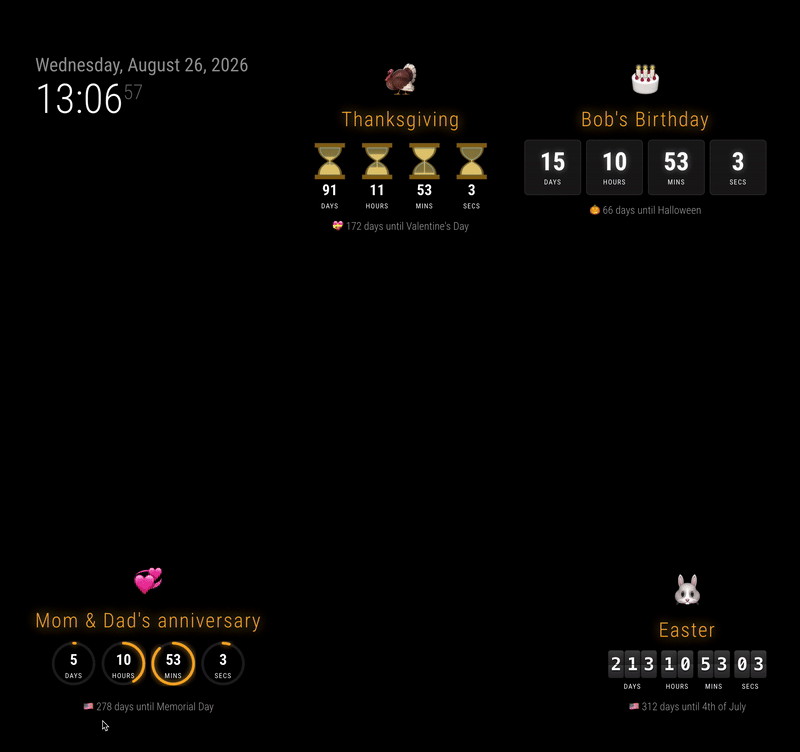

# MMM-EventCountdown

A customizable [MagicMirror²](https://github.com/MagicMirrorOrg/MagicMirror) module for counting down to birthdays, holidays, anniversaries, appointments, trips, and other events.

The nearest event is presented as a stable, live days/hours/minutes/seconds countdown with an optional emoji. A rotating, days-only summary of the later upcoming events fades in and out beneath it; the active main event is excluded from that rotation.



## Project origins

This project combines and extends ideas from two open-source MagicMirror modules:

- [TouaregWarrior/MMM-HolidayCountdown](https://github.com/TouaregWarrior/MMM-HolidayCountdown) provides the original holiday/trip countdown module on which this project is based.
- [double-ratchet/MMM-AnimatedCountdowns](https://github.com/double-ratchet/MMM-AnimatedCountdowns), by ElliAndDad, provides the basis for the digital, flip, progress-ring, and hourglass counter styles adapted here.

The resulting module adds four selectable counter styles, rotating event summaries, reusable yearly events, one-time events, movable-date rules, calculated Easter dates, and per-event emojis.

## Features

- Displays the nearest upcoming event as the main countdown.
- Shows days, hours, minutes, and seconds.
- Offers digital, flip-clock, progress-ring, and hourglass counter styles.
- Rotates through days-only summaries of later upcoming events without repeating the active main event.
- Supports fixed dates, calculated Easter dates, and weekday-based rules.
- Repeats events annually by default.
- Supports one-time events with `repeatYearly: false`.
- Displays an optional emoji for the main event and its rotating summary.

## Installation

Emoji rendering requires the `Noto Color Emoji` font. The font must be installed in the environment where MagicMirror runs: on the host for a standalone installation, or inside the container for Docker.

### Standalone MagicMirror

Install the required emoji font on Debian, Ubuntu, or Raspberry Pi OS:

```bash
sudo apt update
sudo apt install -y fonts-noto-color-emoji
fc-cache -f
fc-match "Noto Color Emoji"
```

The final command should report `NotoColorEmoji.ttf`.

Clone the repository into the MagicMirror `modules` directory:

```bash
cd ~/MagicMirror/modules
git clone https://github.com/trnitz/MMM-EventCountdown.git MMM-EventCountdown
```

Restart a PM2-managed MagicMirror instance using its process name:

```bash
pm2 list
pm2 restart MagicMirror
```

If MagicMirror is started manually, stop it and start it again:

```bash
cd ~/MagicMirror
npm start
```

### Docker MagicMirror

For a running container named `magicmirror`, install the font inside the container:

```bash
docker exec -u root magicmirror apt update
docker exec -u root magicmirror apt install -y fonts-noto-color-emoji
docker exec -u root magicmirror fc-cache -f
docker exec magicmirror fc-match "Noto Color Emoji"
docker restart magicmirror
```

The `fc-match` command should report `NotoColorEmoji.ttf`. A host installation is not sufficient because the browser rendering MagicMirror runs inside the container.

Packages installed with `docker exec` remain through ordinary `docker restart magicmirror` operations, but disappear if the container is removed or recreated. For a persistent installation, build a small custom image:

```dockerfile
FROM karsten13/magicmirror:latest

USER root
RUN apt-get update \
    && apt-get install -y --no-install-recommends fonts-noto-color-emoji \
    && rm -rf /var/lib/apt/lists/*
USER node
```

Save that as `Dockerfile`, then change the MagicMirror service in `compose.yaml` from:

```yaml
image: karsten13/magicmirror:latest
```

to:

```yaml
build: .
image: local/magicmirror-with-emoji
```

Build and recreate the container:

```bash
docker compose build --pull
docker compose up -d --force-recreate
docker exec magicmirror fc-match "Noto Color Emoji"
```

Clone the module into the host directory mounted at `/opt/magic_mirror/modules`. For the example Compose layout in this repository:

```bash
cd /opt/magic_mirror/modules
git clone https://github.com/trnitz/MMM-EventCountdown.git
docker restart magicmirror
```

The final module directory must be named `MMM-EventCountdown` so MagicMirror can load it.

## Configuration

Add the module to the `modules` array in `config/config.js`:

```js
{
    module: "MMM-EventCountdown",
    position: "top_right",
    config: {
        include_today: false,
        updateInterval: 1000,
        summaryDisplaySeconds: 5,
        defaultCounterStyle: "digital",
        events: [
            { name: "Julie's Birthday", date: "2026-07-13", emoji: "🎂", counterStyle: "flip" },
            { name: "US Independence Day", date: "2026-07-04", emoji: "🇺🇸", counterStyle: "rings" },
            { name: "Easter", holiday: "easter", emoji: "🐰" },
            {
                name: "Memorial Day",
                rule: { month: 5, weekday: 1, occurrence: "last" },
                emoji: "🇺🇸"
            },
            {
                name: "One-time appointment",
                date: "2027-02-16",
                repeatYearly: false,
                emoji: "📅"
            }
        ]
    }
},
```

### Module options

| Option | Type | Default | Description |
| --- | --- | --- | --- |
| `events` | array | `[]` | Event entries to display. |
| `include_today` | boolean | `false` | Adds the current day to the displayed countdown when `true`. |
| `updateInterval` | number | `1000` | Self-correcting countdown refresh interval in milliseconds. Missed updates are skipped rather than queued. |
| `summaryDisplaySeconds` | number | `5` | Number of seconds each lower summary remains visible. |
| `defaultCounterStyle` | string | `"digital"` | Fallback counter style: `"digital"`, `"flip"`, `"rings"`, or `"hourglass"`. |

## Event entry format

Every entry requires `name` and one date source: `date`, `holiday`, or `rule`.

| Field | Type | Required | Description |
| --- | --- | --- | --- |
| `name` | string | Yes | Text displayed for the event. |
| `date` | string | One date source | Fixed date in `YYYY-MM-DD` format. |
| `holiday` | string | One date source | Special calculated holiday identifier. Currently only `easter` is supported. |
| `rule` | object | One date source | Rule for an event such as the second Sunday in May. |
| `emoji` | string | No | Emoji shown above the main countdown and beside the event's rotating summary. |
| `repeatYearly` | boolean | No | Controls annual recurrence. The default is `true`. |
| `counterStyle` | string | No | Overrides `defaultCounterStyle` for this event. |

The legacy `icon` field is accepted as a fallback, but new entries should use `emoji`.

### Counter styles

Set one style globally with `defaultCounterStyle`, then optionally override it on individual events with `counterStyle`:

```js
config: {
    defaultCounterStyle: "digital",
    events: [
        { name: "Digital example", date: "2026-09-01", counterStyle: "digital" },
        { name: "Flip example", date: "2026-09-02", counterStyle: "flip" },
        { name: "Rings example", date: "2026-09-03", counterStyle: "rings" },
        { name: "Hourglass example", date: "2026-09-04", counterStyle: "hourglass" }
    ]
}
```

| Style | Description |
| --- | --- |
| `digital` | Four numeric boxes; this project's original and default display. |
| `flip` | Split-digit clock with a flip animation when a digit changes. |
| `rings` | Circular progress indicators for days, hours, minutes, and seconds. |
| `hourglass` | Four draining hourglasses that flip when their time units roll over. |

The main event controls the visible counter style. The fading event summaries retain their compact text-and-emoji presentation.

### Fixed-date events

Dates use the local calendar and must be written as `YYYY-MM-DD`:

```js
{ name: "Halloween", date: "2026-10-31", emoji: "🎃" }
```

Because yearly repetition is enabled by default, the year makes the value a valid full date while the module uses the month and day for future occurrences.

### Annual repetition: `repeatYearly`

`repeatYearly` defaults to `true`. You normally do not need to include it for birthdays, anniversaries, or annual holidays:

```js
// Repeats every July 13
{ name: "Birthday", date: "2026-07-13", emoji: "🎂" }
```

When this year's date passes, the module automatically selects the same event in the following year.

Set `repeatYearly: false` for an event that must happen only once:

```js
{ name: "Concert", date: "2027-02-16", repeatYearly: false, emoji: "🎵" }
```

After a one-time event passes, it is removed from the upcoming-event display. The same setting also applies to `holiday` and `rule` entries; when disabled, only the occurrence in the current year is considered.

### Calculated Easter date

Easter changes dates each year and cannot be represented by a fixed date or simple weekday rule. Use the special `easter` identifier:

```js
{ name: "Easter", holiday: "easter", emoji: "🐰" }
```

The module calculates Gregorian Easter Sunday locally for the relevant year. It does not use an external API or require an internet connection. No other named holidays are built in.

### Movable-date rules

Use `rule` for events described by a weekday occurrence within a month:

```js
// Second Sunday in May
{ name: "Mother's Day", rule: { month: 5, weekday: 0, occurrence: 2 }, emoji: "💐" },

// Last Monday in May
{ name: "Memorial Day", rule: { month: 5, weekday: 1, occurrence: "last" }, emoji: "🇺🇸" }

// Fourth Thursday in November
{ name: "US Thanksgiving", rule: { month: 11, weekday: 4, occurrence: 4 }, emoji: "🦃" }
```

| Field | Accepted values | Description |
| --- | --- | --- |
| `month` | `1`–`12` | January is `1`; December is `12`. |
| `weekday` | `0`–`6` | Sunday is `0`; Saturday is `6`. |
| `occurrence` | `1`–`5` or `"last"` | Which matching weekday to select. |

## Emoji

Copy an emoji into the optional `emoji` field:

```js
{ name: "Anniversary", date: "2026-09-20", emoji: "💍❤️" }
```

The emoji appears above the current main event and beside that event in the fading summary below the countdown.

This module uses native Unicode emojis and expects `Noto Color Emoji` to be installed. Verify the font in the same environment where MagicMirror runs:

```bash
# Standalone
fc-match "Noto Color Emoji"

# Docker container named magicmirror
docker exec magicmirror fc-match "Noto Color Emoji"
```

After installing the font, restart the standalone MagicMirror process or run `docker restart mm` for Docker. The configuration file must be UTF-8 encoded.

Useful emoji references include [Emojipedia](https://emojipedia.org/) and the [Unicode Emoji List](https://unicode.org/emoji/charts/full-emoji-list.html).

## Updating

From the installed module directory:

```bash
cd ~/MagicMirror/modules/MMM-EventCountdown
git pull
```

Restart MagicMirror after changing the module or its configuration.

## License and attribution

The original `MMM-HolidayCountdown` project and `MMM-AnimatedCountdowns` are MIT licensed. The adapted counter renderers and styles retain attribution to ElliAndDad/double-ratchet in this README, the source comments, and the repository license.
